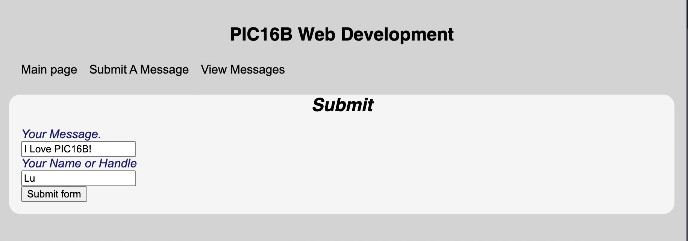
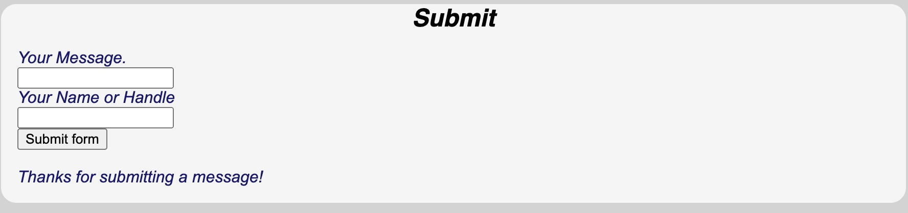

This blog teaches you how to create a webpage with code stored in [this GitHub](https://github.com/lu18cheng/pic16b_web_development).

## Relevant files 

The purpose of this webpage is to create a interactive page to submit a quote and a name and another page to display some random quotes. The overall app requires the following files 

- `app.py` to initialize the application and include relevant functions to define the webpages. 
- `html` templates to render each webpage. This webpage app is made with `main.html`, `base.html`, `submit.html` and `view.html`.  
- `css` files can also be included to modify appearance of the website

## Working with `app.py`

### Basic Flask App 
```python
# Import relevant functions from flask package
from flask import Flask, g, render_template, request 

app = Flask(__name__)

# Create main page
@app.route('/')
def main():
    return render_template('main.html')
```
The above code gives a basic Flask application with the main page designed in `main.html`. 

Now we could run 
```
export FLASK_ENV=development; flask run
```
on terminal and the site will be available at http://localhost:5000.

## Make a page to allow quote submissions

### Render template for submit page
```python
@app.route('/submit/', methods=['POST', 'GET'])
def submit():
    if request.method == 'GET':
        return render_template('submit.html')
    else:
        try:
            insert_message(request)
            return render_template('submit.html', thanks=True)
        except:
            return render_template('submit.html', error=True)
```
Above code renders the submit template. If a user submits a message, the function would try to add the message into database and returns a thanks message if success, error message if something goes wrong. 

### Functions to create and modify database

```python
def get_message_db():
    #function to get message_db
    #first try returning g.message_db, if cannot be found, create a new one
    try:
        return g.message_db
    except:
        g.message_db = sqlite3.connect("messages_db.sqlite")
        cmd = \
        '''
        CREATE TABLE IF NOT EXISTS `messages` (
            id INTEGER PRIMARY KEY AUTOINCREMENT,
            handle TEXT NOT NULL,
            message TEXT NOT NULL
        );
        '''
        cursor = g.message_db.cursor()
        cursor.execute(cmd)
        return g.message_db

def insert_message(request):
    #function to insert message to message_db
    conn = get_message_db()
    cmd = \
    f'''
    INSERT INTO messages (handle, message)
        VALUES ('{request.form["handle"]}', '{request.form["message"]}'); 
    '''
    cursor = conn.cursor()
    cursor.execute(cmd)
    conn.commit()
    conn.close()
```

### submit.html
The following code shows the code inside `submit.html`. It first `extend`s templates from `base.html` which puts navigation links on the top of the screen. Then include text messages and submission boxes to prompt for user input. The `insert_message` and `submit` functions that we defined before would try to add the input to our database. 

```html



  <h1>Submit</h1>



  <form method="post" enctype="multipart/form-data">
      <label for="message">Your Message.</label>
      <br>
      <input type = "text" name="message" id="message">
      <br>
      <label for="name">Your Name or Handle</label>
       <br>
      <input type = "text" name="handle" id="handle">
       <br>
      <input type="submit" value="Submit form">
  </form>

  
    <br>
    Thanks for submitting a message!
  

  
    <br>
    Oh no, we couldn't use that message!
  


```

The submission page looks like this


And after submitting you would get a confirmation message


## View Random Submissions 

### Function generate and display random submission messages
```python
@app.route('/view/')
def view():
    #render template to display 5 random messages 
    return render_template('view.html', messages = random_messages(5))

def random_messages(n):
    conn = get_message_db()
    cursor = conn.cursor()
    cursor.execute(f"SELECT handle, message FROM messages ORDER BY RANDOM() LIMIT {n}")
    msg = cursor.fetchall()
    return msg
```


### view.html

The following code shows the code inside `view.html`. Again, it first extends templates from base.html which puts navigation links on the top of the screen. Then it loops over the random messages generated by `random_messages(n)` and display the messages with a `for` loop.

```html

  <h1>View Some Cool Messages</h1>



<ol>

    <br>
    <li>{{msg[1]}}</li>
    <p>      -{{ msg[0]}} </p>
    <br>

</ol>

```

Here is the page to view some random messages

