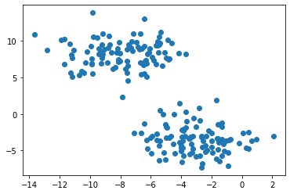
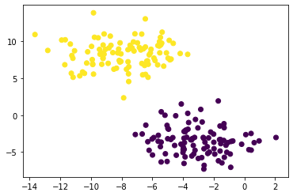
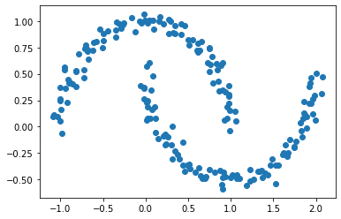
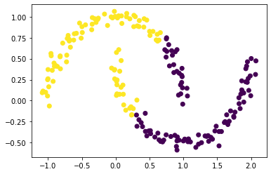
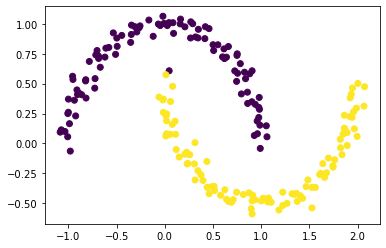

In this blog post, we would show a tutorial on how to write a simple version of the *spectral clustering* algorithm for clustering data points.

### Notation

In all the math below: 

- Boldface capital letters like $$\mathbf{A}$$ refer to matrices (2d arrays of numbers). 
- Boldface lowercase letters like $$\mathbf{v}$$ refer to vectors (1d arrays of numbers). 
- $$\mathbf{A}\mathbf{B}$$ refers to a matrix-matrix product (`A @ B`). $$\mathbf{A}\mathbf{v}$$ refers to a matrix-vector product (`A @ v`). 


## Introduction

We'll first show a few examples to study *spectral clustering*, which is an important tool for identifying meaningful parts of complex data sets. Let's start with an example where we *don't* need spectral clustering. 


```python
import numpy as np
from sklearn import datasets
from matplotlib import pyplot as plt
```

```python
n = 200
np.random.seed(1111)
X, y = datasets.make_blobs(n_samples=n, shuffle=True, random_state=None, centers = 2, cluster_std = 2.0)
plt.scatter(X[:,0], X[:,1])
```

    

    

K-means is a very common algorithm to cluster circular-ish blobs like these: 


```python
from sklearn.cluster import KMeans
km = KMeans(n_clusters = 2)
km.fit(X)

plt.scatter(X[:,0], X[:,1], c = km.predict(X))
```


    

    


### Harder Clustering

However, k-means doesnt always work especially on complex datasetes.

```python
np.random.seed(1234)
n = 200
X, y = datasets.make_moons(n_samples=n, shuffle=True, noise=0.05, random_state=None)
plt.scatter(X[:,0], X[:,1])
```



    


```python
km = KMeans(n_clusters = 2)
km.fit(X)
plt.scatter(X[:,0], X[:,1], c = km.predict(X))
```

    

    

In the above case, the clusters we want to identify aren't circular clusters but moon shaped. k-mean does not work so well and we would need some other algorithms. In the following problems, we will derive and implement spectral clustering. 

## Part A

We start by constructing the *similarity matrix* $$\mathbf{A} \in \{0,1\}^{n\times n}$$, using a parameter `epsilon`. Entry `A[i,j]` should be equal to `1` if `X[i]` (the coordinates of data point `i`) is within distance `epsilon` of `X[j]` (the coordinates of data point `j`), and `0` otherwise. 

**Note: The diagonal entries `A[i,i]` should all be equal to zero.**


For this part, we use `epsilon = 0.4` as an example.


```python
from sklearn.metrics.pairwise import euclidean_distances

A = euclidean_distances(X) #calculate the euclidean distance between pairs of points

epsilon = 0.4
A = np.where(A < epsilon, 1, 0) #fill A with values < epsilon to be 1 and >= epsilon to be 0
np.fill_diagonal(A, 0) #fill diagonal of A to be 0
A
```


    array([[0, 0, 0, ..., 0, 0, 0],
           [0, 0, 0, ..., 0, 0, 0],
           [0, 0, 0, ..., 0, 1, 0],
           ...,
           [0, 0, 0, ..., 0, 1, 1],
           [0, 0, 1, ..., 1, 0, 1],
           [0, 0, 0, ..., 1, 1, 0]])


## Part B

The matrix `A` now contains information about which points are near (within distance `epsilon`) which other points. We now hope to cluster the data points in `X` through  partitioning the rows and columns of `A`. 

Let $$d_i = \sum_{j = 1}^n a_{ij}$$ be the $$i$$th row-sum of $$\mathbf{A}$$ (the *degree* of $$i$$). Let $$C_0$$ and $$C_1$$ be two clusters of the data points. We assume that every data point is in either $$C_0$$ or $$C_1$$. The cluster membership as being specified by `y`. i.e., if `y[i] = 1`, then point `i` (and therefore row $$i$$ of $$\mathbf{A}$$) is an element of cluster $$C_1$$.  

The *binary norm cut objective* of a matrix $$\mathbf{A}$$ is the function 

$$N_{\mathbf{A}}(C_0, C_1)\equiv \mathbf{cut}(C_0, C_1)\left(\frac{1}{\mathbf{vol}(C_0)} + \frac{1}{\mathbf{vol}(C_1)}\right)\;.$$

In this expression, 
- $$\mathbf{cut}(C_0, C_1) \equiv \sum_{i \in C_0, j \in C_1} a_{ij}$$ is the *cut* of the clusters $$C_0$$ and $$C_1$$. 
- $$\mathbf{vol}(C_0) \equiv \sum_{i \in C_0}d_i$$, where $$d_i = \sum_{j = 1}^n a_{ij}$$ is the *degree* of row $$i$$ (the total number of all other rows related to row $$i$$ through $$A$$). The *volume* of cluster $$C_0$$ is a measure of the size of the cluster. 

A pair of clusters $$C_0$$ and $$C_1$$ is considered to be a "good" partition of the data when $$N_{\mathbf{A}}(C_0, C_1)$$ is small. We will look at each of the two factors in this objective function separately to see why.


#### B.1 The Cut Term

First, the cut term $$\mathbf{cut}(C_0, C_1)$$ is the number of nonzero entries in $$\mathbf{A}$$ that relate points in cluster $$C_0$$ to points in cluster $$C_1$$. This term is expected to be small if points in $$C_0$$ aren't very close to points in $$C_1$$. 

We write a function called `cut(A,y)` to compute the cut term, by summing up the entries `A[i,j]` for each pair of points `(i,j)` in different clusters. 


```python
def cut(A, y):
    #first find indexes corresponding to C1
    mask = y.astype(bool) 
    #subset the rows with points in C1 and columns with points in C2 
    #and take sum 
    return A[mask, :][:, ~mask].sum() 
```


Let's try computing the cut objective for the true clusters `y`. We get a number of 13 which means only 13 pair of points in $$C_0$$ and $$C_1$$ are close.

```python
cut(A, y)
```
    13

Now let's see the cut for a randomly generated labels for `y`. 
```python
y_ = np.random.randint(0, 2, n) #generate a random vector of length n
cut(A, y_)
```

    1150

We find that the cut objective for the true labels is *much* smaller than the cut objective for the random labels, which shows that this part of the cut objective indeed favors the true clusters over the random ones. 

#### B.2 The Volume Term 

Now take a look at the second factor in the norm cut objective. This is the *volume term*. As mentioned above, the *volume* of cluster $$C_0$$ is a measure of how "big" cluster $$C_0$$ is. If we choose cluster $$C_0$$ to be small, then $$\mathbf{vol}(C_0)$$ will be small and $$\frac{1}{\mathbf{vol}(C_0)}$$ will be large, leading to an undesirable higher objective value. 

Synthesizing, the binary normcut objective asks us to find clusters $$C_0$$ and $$C_1$$ such that:

1. There are relatively few entries of $$\mathbf{A}$$ that join $$C_0$$ and $$C_1$$. 
2. Neither $$C_0$$ and $$C_1$$ are too small. 

We write a function called `vols(A,y)` which computes the volumes of $$C_0$$ and $$C_1$$, returning them as a tuple. 

We also write a function called `normcut(A,y)` which uses `cut(A,y)` and `vols(A,y)` to compute the binary normalized cut objective of a matrix `A` with clustering vector `y`. 

```python
def vols(A, y):
    row_sum = A.sum(axis = 1) #take row sum of A to get degree of each row
    mask = y.astype(bool) #make a boolean mask to subset the rows
    v1 = sum(row_sum[mask]) #sum degree values with y=1
    v0 = sum(row_sum[~mask]) #sum degree values with y=0
    return v0, v1

def normcut(A, y):
    v0, v1 = vols(A, y) #get v0, v1 from vols()
    return cut(A,y) * (1/v0 + 1/v1) #calculate normcut of A with formula
```

Now we compare the `normcut` objective using both the true labels `y` and the fake labels generated above.


```python
# true labels y
normcut(A, y)
```

    0.011518412331615225


```python
# random labels y
normcut(A, y_)
```


    1.0240023597759158


We see that the normcut for the true labels is much smaller comparing to the normcut for the fake labels. Indeed, this is a good objective function for our purposes. 

## Part C

We have now defined a normalized cut objective which takes small values when the input clusters are (a) joined by relatively few entries in $$A$$ and (b) not too small. One approach to clustering is to try to find a cluster vector `y` such that `normcut(A,y)` is small. However, this is an NP-hard combinatorial optimization problem. We will use a math trick to solve the problem.

Here's the trick: define a new vector $$\mathbf{z} \in \mathbb{R}^n$$ such that: 

$$
z_i = 
\begin{cases}
    \frac{1}{\mathbf{vol}(C_0)} &\quad \text{if } y_i = 0 \\ 
    -\frac{1}{\mathbf{vol}(C_1)} &\quad \text{if } y_i = 1 \\ 
\end{cases}
$$


Note that the signs of  the elements of $$\mathbf{z}$$ contain all the information from $$\mathbf{y}$$: if $$i$$ is in cluster $$C_0$$, then $$y_i = 0$$ and $$z_i > 0$$. 

Then the norm cut function becomes

$$\mathbf{N}_{\mathbf{A}}(C_0, C_1) = \frac{\mathbf{z}^T (\mathbf{D} - \mathbf{A})\mathbf{z}}{\mathbf{z}^T\mathbf{D}\mathbf{z}}\;,$$

where $$\mathbf{D}$$ is the diagonal matrix with nonzero entries $$d_{ii} = d_i$$, and  where $$d_i = \sum_{j = 1}^n a_i$$ is the degree (row-sum) from before.  


Now we will show that the two functions are the same
1. We write a function called `transform(A,y)` to compute the appropriate $$\mathbf{z}$$ vector given `A` and `y`, using the formula above. 
2. We check that the equation above relates the matrix product to the normcut objective, by computing each side separately and checking that they are equal. 
3. Also check the identity $$\mathbf{z}^T\mathbf{D}\mathbb{1} = 0$$, where $$\mathbb{1}$$ is the vector of `n` ones (i.e. `np.ones(n)`). This identity effectively says that $$\mathbf{z}$$ should contain roughly as many positive as negative entries. (We will use`np.isclose` as there could be rounding errors)


```python
def transform(A, y):
    #use definition above to define transform
    v0, v1 = vols(A, y) 
    return np.where(y==1, -1/v1, 1/v0)
```


```python
#calculate N_A using above function
z = transform(A, y)
D = np.diag(A.sum(axis=1))
N_A = (z.T @ (D - A) @ z) / (z.T @ D @ z)
N_A
```


    0.011518412331615099


```python
# check N_A calculated by above formula is close enough to normcut
np.isclose(N_A, normcut(A,y))
```


    True


```python
# check z.T @ D @ 1 = 0
np.isclose(z.T @ D @ np.ones(n), 0)
```


    True


## Part D

In the last part, we saw that the problem of minimizing the normcut objective is mathematically related to the problem of minimizing the function 

$$ R_\mathbf{A}(\mathbf{z})\equiv \frac{\mathbf{z}^T (\mathbf{D} - \mathbf{A})\mathbf{z}}{\mathbf{z}^T\mathbf{D}\mathbf{z}} $$

subject to the condition $$\mathbf{z}^T\mathbf{D}\mathbb{1} = 0$$. It's actually possible to bake this condition into the optimization, by substituting for $$\mathbf{z}$$ the orthogonal complement of $$\mathbf{z}$$ relative to $$\mathbf{D}\mathbf{1}$$. We define `orth_obj` function to handles this situation.


```python
def orth(u, v):
    return (u @ v) / (v @ v) * v

e = np.ones(n) 

d = D @ e

def orth_obj(z):
    z_o = z - orth(z, d)
    return (z_o @ (D - A) @ z_o)/(z_o @ D @ z_o)
```

Then we use the `minimize` function from `scipy.optimize` to minimize the function `orth_obj` with respect to $$\mathbf{z}$$, call it  `z_min`. 

```python
from scipy.optimize import minimize 

cons = ({'type': 'eq', 'fun': lambda x:  x.T @ D @ e})
res = minimize(orth_obj, x0 = transform(A, y_), constraints = cons)
z_min = res.x
```

**Note**: we are approximating the normcut objective so what we get is not exact. 

## Part E

Recall that, by design, only the sign of `z_min[i]` actually contains information about the cluster label of data point `i`. Thus, we can use the sign `z_min` to assign each point to a cluster. 

```python
plt.scatter(X[:,0], X[:,1], c = (z_min < 0))
```

    

    

We can see that the cluster is very close to original data except one point on the bottom moon is labeled to the other cluster.

## Part F

Explicitly optimizing the orthogonal objective is  *way* too slow to be practical, and another trick is that we can actually solve the problem from Part E using eigenvalues and eigenvectors of matrices. 

Recall that what we would like to do is minimize the function 

$$ R_\mathbf{A}(\mathbf{z})\equiv \frac{\mathbf{z}^T (\mathbf{D} - \mathbf{A})\mathbf{z}}{\mathbf{z}^T\mathbf{D}\mathbf{z}} $$

with respect to $$\mathbf{z}$$, subject to the condition $$\mathbf{z}^T\mathbf{D}\mathbb{1} = 0$$. 

The Rayleigh-Ritz Theorem states that the minimizing $$\mathbf{z}$$ must be the solution with smallest eigenvalue of the generalized eigenvalue problem 

$$ (\mathbf{D} - \mathbf{A}) \mathbf{z} = \lambda \mathbf{D}\mathbf{z}\;, \quad \mathbf{z}^T\mathbf{D}\mathbb{1} = 0$$

which is equivalent to the standard eigenvalue problem 

$$ \mathbf{D}^{-1}(\mathbf{D} - \mathbf{A}) \mathbf{z} = \lambda \mathbf{z}\;, \quad \mathbf{z}^T\mathbb{1} = 0\;.$$

Since $$\mathbb{1}$$ is actually the eigenvector with smallest eigenvalue of the matrix $$\mathbf{D}^{-1}(\mathbf{D} - \mathbf{A})$$. 

**So, the vector $$\mathbf{z}$$ that we want must be the eigenvector with  the *second*-smallest eigenvalue.**

We will do the following
1. Construct the matrix $$\mathbf{L} = \mathbf{D}^{-1}(\mathbf{D} - \mathbf{A})$$, which is often called the (normalized) *Laplacian* matrix of the similarity matrix $$\mathbf{A}$$. 
2.  Find the eigenvector corresponding to its second-smallest eigenvalue, and call it `z_eig`.
3.  Plot the data again, using the sign of `z_eig` as the color. 

```python
L = np.linalg.inv(D) @ (D - A)
Lam, U = np.linalg.eig(L)

ix = Lam.argsort()

# the eigenvector corresponding to the 2nd smallest eigenvalue
z_eig = U[:,ix[1]]

plt.scatter(X[:,0], X[:,1], c = (z_eig < 0))
```



We see that the result is the same as what we have from part E.

## Part G

Finally, we synthesis the results from the previous parts and write a function called `spectral_clustering(X, epsilon)` which takes in the input data `X` and the distance threshold `epsilon` and performs spectral clustering, returning an array of binary labels indicating whether data point `i` is in group `0` or group `1`.

In summary, will use the data to 
1. Construct the similarity matrix. 
2. Construct the Laplacian matrix. 
3. Compute the eigenvector with second-smallest eigenvalue of the Laplacian matrix. 
4. Return labels based on this eigenvector. 


```python
def spectral_clustering(X, epsilon):
    '''
    This function performs a binary spectral clustering on the given data and epsilon cutoff
    
    =====params=====
    X: a n by m matrix given the coordinates of the points to cluster
    epsilon: the cut off to label the similarity matrix
    '''
    
    #construct similarity matrix
    A = euclidean_distances(X)
    A = np.where(A < epsilon, 1, 0)
    np.fill_diagonal(A, 0)
    
    #construct Laplacian matrix
    D = np.diag(A.sum(axis=1)) 
    L = np.linalg.inv(D) @ (D - A)
    
    #compute the eigenvector with second-smallest eigenvalue of the laplacian matrix
    Lam, U = np.linalg.eig(L)
    ix = Lam.argsort()
    z_eig = U[:,ix[1]]
    return np.where(z_eig > 0, 0, 1)
```


```python
plt.scatter(X[:,0], X[:,1], c = spectral_clustering(X, epsilon))
```


    

    
    
Note we have successfully write a function to compute spectral clustering on any given dataset. 


## Part H

Now we run a few experiments using the define function, by generating different data sets using `make_moons`. We also alter the noise to see how spectral clustering perform in situation with high noise. Here we also increase `n` to 1000 as we have a fast algorithm!


```python
n = 1000

noises = [0.05, 0.1, 0.15, 0.2] #feed in a list of noises

fig, ax = plt.subplots(2, 2, figsize = (10,8))

#generate plots colored by spectral clustering
for i, noise in enumerate(noises):
    X, y = datasets.make_moons(n_samples=n, 
                                shuffle=True, 
                                noise=noise,
                                random_state=None)
    ax[i//2, i%2].scatter(X[:,0], X[:,1], c=spectral_clustering(X, epsilon))
```

    

    
In the above picture we see that as noise gets larger, the two groups becomes closer togeteher, making it harder for the algorihtm to distinguish the two groups. The algorithm works well with noise$$=0.05$$ or $$0.1$$ but fails to distinguish the two groups when noise$$\geq 0.15$$


## Part I

Now try your spectral clustering function on another data set -- the bull's eye! 


```python
n = 1000
X, y = datasets.make_circles(n_samples=n, shuffle=True, noise=0.05, random_state=None, factor = 0.4)
plt.scatter(X[:,0], X[:,1])
```


    


There are two concentric circles, which does not work using k-means.


```python
km = KMeans(n_clusters = 2)
km.fit(X)
plt.scatter(X[:,0], X[:,1], c = km.predict(X))
```


    

    


Let's try if our function can successfully separate the two circles. We use a range of values betwwen 0 and 1 as our value for `epsilon`. 


```python
np.random.seed(1234)
n = 1000

epsilons = [0.2, 0.4, 0.6, 0.8]
fig, ax = plt.subplots(2, 2, figsize = (10,8))

for i, epsilon in enumerate(epsilons):
    ax[i//2, i%2].scatter(X[:,0], X[:,1], c=spectral_clustering(X, epsilon))
```


    

    

In the figure we see that the algorithm is able to successfully separate the two groups with `epsilon=0.2, 0.4`, but fail to do so with `epsilon=0.6, 0.8`.

## Part J

Great work! 
