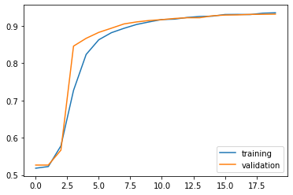
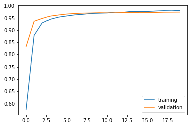
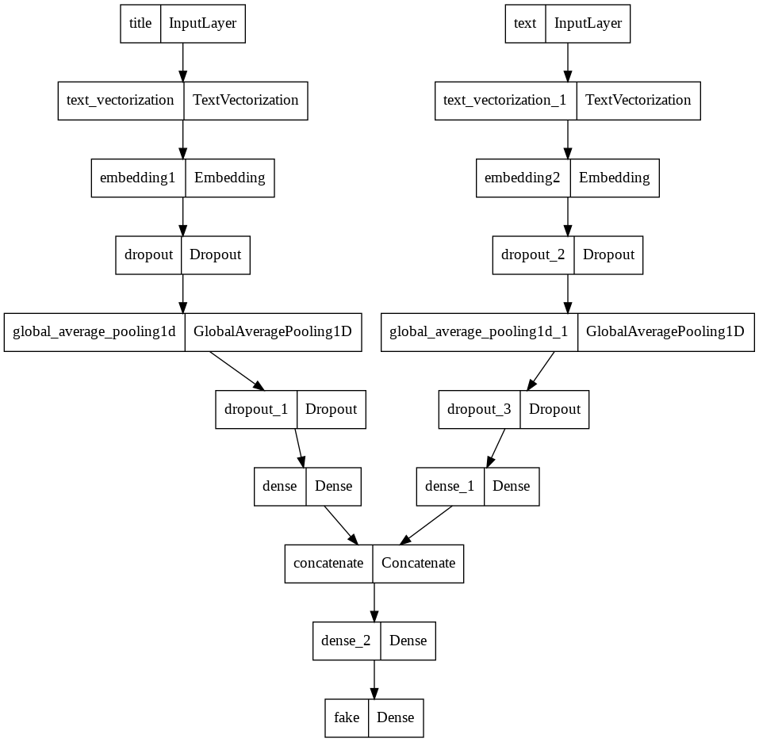
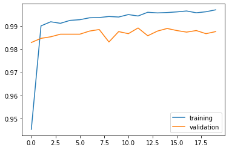

In this blog post, we will introduce how to build a machine learning model to predict whether a piece of news is fake base on it's title and text. 


## Import Packages

We start by importing required packages. 


```python
import numpy as np
import pandas as pd
import tensorflow as tf
import re
import string

from tensorflow.keras import layers, losses, Input, Model, utils
from tensorflow.keras.layers.experimental.preprocessing import TextVectorization, StringLookup

from sklearn.model_selection import train_test_split
from sklearn.preprocessing import LabelEncoder

# for embedding viz
import matplotlib.pyplot as plt

import plotly.express as px 
import plotly.io as pio
pio.templates.default = "plotly_white"
```

## Acquire Training Data

Next, we obtain our training data from the given URL.


```python
train_url = "https://github.com/PhilChodrow/PIC16b/blob/master/datasets/fake_news_train.csv?raw=true"
df = pd.read_csv(train_url, index_col = 0)
```


```python
df.head()
```


  <div id="df-03f2fb22-d37a-4880-b5cb-2cdd600484c4">
    <div class="colab-df-container">
      <div>
<style scoped>
    .dataframe tbody tr th:only-of-type {
        vertical-align: middle;
    }

    .dataframe tbody tr th {
        vertical-align: top;
    }

    .dataframe thead th {
        text-align: right;
    }
</style>
<table border="1" class="dataframe">
  <thead>
    <tr style="text-align: right;">
      <th></th>
      <th>title</th>
      <th>text</th>
      <th>fake</th>
    </tr>
  </thead>
  <tbody>
    <tr>
      <th>17366</th>
      <td>Merkel: Strong result for Austria's FPO 'big c...</td>
      <td>German Chancellor Angela Merkel said on Monday...</td>
      <td>0</td>
    </tr>
    <tr>
      <th>5634</th>
      <td>Trump says Pence will lead voter fraud panel</td>
      <td>WEST PALM BEACH, Fla.President Donald Trump sa...</td>
      <td>0</td>
    </tr>
    <tr>
      <th>17487</th>
      <td>JUST IN: SUSPECTED LEAKER and “Close Confidant...</td>
      <td>On December 5, 2017, Circa s Sara Carter warne...</td>
      <td>1</td>
    </tr>
    <tr>
      <th>12217</th>
      <td>Thyssenkrupp has offered help to Argentina ove...</td>
      <td>Germany s Thyssenkrupp, has offered assistance...</td>
      <td>0</td>
    </tr>
    <tr>
      <th>5535</th>
      <td>Trump say appeals court decision on travel ban...</td>
      <td>President Donald Trump on Thursday called the ...</td>
      <td>0</td>
    </tr>
  </tbody>
</table>
</div>
      <button class="colab-df-convert" onclick="convertToInteractive('df-03f2fb22-d37a-4880-b5cb-2cdd600484c4')"
              title="Convert this dataframe to an interactive table."
              style="display:none;">

  <svg xmlns="http://www.w3.org/2000/svg" height="24px"viewBox="0 0 24 24"
       width="24px">
    <path d="M0 0h24v24H0V0z" fill="none"/>
    <path d="M18.56 5.44l.94 2.06.94-2.06 2.06-.94-2.06-.94-.94-2.06-.94 2.06-2.06.94zm-11 1L8.5 8.5l.94-2.06 2.06-.94-2.06-.94L8.5 2.5l-.94 2.06-2.06.94zm10 10l.94 2.06.94-2.06 2.06-.94-2.06-.94-.94-2.06-.94 2.06-2.06.94z"/><path d="M17.41 7.96l-1.37-1.37c-.4-.4-.92-.59-1.43-.59-.52 0-1.04.2-1.43.59L10.3 9.45l-7.72 7.72c-.78.78-.78 2.05 0 2.83L4 21.41c.39.39.9.59 1.41.59.51 0 1.02-.2 1.41-.59l7.78-7.78 2.81-2.81c.8-.78.8-2.07 0-2.86zM5.41 20L4 18.59l7.72-7.72 1.47 1.35L5.41 20z"/>
  </svg>
      </button>

  <style>
    .colab-df-container {
      display:flex;
      flex-wrap:wrap;
      gap: 12px;
    }

    .colab-df-convert {
      background-color: #E8F0FE;
      border: none;
      border-radius: 50%;
      cursor: pointer;
      display: none;
      fill: #1967D2;
      height: 32px;
      padding: 0 0 0 0;
      width: 32px;
    }

    .colab-df-convert:hover {
      background-color: #E2EBFA;
      box-shadow: 0px 1px 2px rgba(60, 64, 67, 0.3), 0px 1px 3px 1px rgba(60, 64, 67, 0.15);
      fill: #174EA6;
    }

    [theme=dark] .colab-df-convert {
      background-color: #3B4455;
      fill: #D2E3FC;
    }

    [theme=dark] .colab-df-convert:hover {
      background-color: #434B5C;
      box-shadow: 0px 1px 3px 1px rgba(0, 0, 0, 0.15);
      filter: drop-shadow(0px 1px 2px rgba(0, 0, 0, 0.3));
      fill: #FFFFFF;
    }
  </style>

      <script>
        const buttonEl =
          document.querySelector('#df-03f2fb22-d37a-4880-b5cb-2cdd600484c4 button.colab-df-convert');
        buttonEl.style.display =
          google.colab.kernel.accessAllowed ? 'block' : 'none';

        async function convertToInteractive(key) {
          const element = document.querySelector('#df-03f2fb22-d37a-4880-b5cb-2cdd600484c4');
          const dataTable =
            await google.colab.kernel.invokeFunction('convertToInteractive',
                                                     [key], {});
          if (!dataTable) return;

          const docLinkHtml = 'Like what you see? Visit the ' +
            '<a target="_blank" href=https://colab.research.google.com/notebooks/data_table.ipynb>data table notebook</a>'
            + ' to learn more about interactive tables.';
          element.innerHTML = '';
          dataTable['output_type'] = 'display_data';
          await google.colab.output.renderOutput(dataTable, element);
          const docLink = document.createElement('div');
          docLink.innerHTML = docLinkHtml;
          element.appendChild(docLink);
        }
      </script>
    </div>
  </div>


As you see, the dataset contains title, full article text and labels for whether the news is fake. A piece of fake news is labeled as 1 while a piece of true news is labeled as 0.

## Make a Dataset

Now we write a function to prepare our dataset 


```python
from gensim.utils import simple_preprocess # lowercases, tokenizes, de-accents
import nltk
# nltk.download('stopwords')
from nltk.corpus import stopwords
stop_words = stopwords.words('english')

def remove_stopwords(texts):
  # function to preprocess (lowercase, tokenizes and de-accents text) and remove stopwords
  return [' '.join([word for word in simple_preprocess(str(doc)) if word not in stop_words]) for doc in texts]

def make_dataset(data):
  # preprocess the dataset for feeding into the tensorflow model
  data['title'] = remove_stopwords(data['title']) #remove stopwords from titles
  data['text'] = remove_stopwords(data['text']) #remove stopwords from text
  data = tf.data.Dataset.from_tensor_slices( #process it into a tensorflow data
      (
        {
            "title" : data[["title"]], 
            "text" : data[["text"]]
        }, 
        {
            "fake" : data["fake"]
        }
    )
  )
  return data.batch(100)
```


```python
df = make_dataset(df) #use the make_dataset function to prepare the data
```

### Validation Data

After preprocessing the data, we split it into 80% and 20% subsets for training and validaton.


```python
train_size = int(0.8*len(df))
val_size   = int(0.2*len(df))

train = df.take(train_size)
val   = df.skip(train_size).take(val_size)
```


```python
len(train), len(val)
```


    (180, 45)


### Base Rate

We would get a count of the data to get a baseline for our prediction.


```python
labels_iterator= train.unbatch().map(lambda text, label: label['fake']).as_numpy_iterator()

true_counts = 0
fake_counts = 0
for label in labels_iterator:
  if label == 0:
    true_counts += 1
  else:
    fake_counts += 1
print(f"The train dataset contains {true_counts} samples of true news, which is {true_counts/(true_counts+fake_counts)*100}% of the whole dataset")
print(f"It contains {fake_counts} samples of fake news, which is {fake_counts/(true_counts+fake_counts)*100}% of the whole dataset")
```

    The train dataset contains 8603 samples of true news, which is 47.794444444444444% of the whole dataset
    It contains 9397 samples of fake news, which is 52.20555555555556% of the whole dataset


Based on the labels in our training dataset, we have a baseline score of 52.2%. When evaluating our model performance, we would compare the accuracy with our baseliene. 

## Create Models

### Model 1


```python
#preparing a text vectorization layer for tf model
size_vocabulary = 2000

def standardization(input_data):
    lowercase = tf.strings.lower(input_data)
    no_punctuation = tf.strings.regex_replace(lowercase,
                                  '[%s]' % re.escape(string.punctuation),'')
    return no_punctuation 

title_vectorize_layer = TextVectorization(
    standardize=standardization,
    max_tokens=size_vocabulary, # only consider this many words
    output_mode='int',
    output_sequence_length=500) 

title_vectorize_layer.adapt(train.map(lambda x, y: x["title"]))
```


```python
# inputs
titles_input = Input(
    shape = (1,), 
    name = "title",
    dtype = "string"
)
```


```python
# layers for processing the titles
titles_features = title_vectorize_layer(titles_input)
titles_features = layers.Embedding(size_vocabulary, 3, name = "embedding1")(titles_features)
titles_features = layers.Dropout(0.2)(titles_features)
titles_features = layers.GlobalAveragePooling1D()(titles_features)
titles_features = layers.Dropout(0.2)(titles_features)
titles_features = layers.Dense(32, activation='relu')(titles_features)
```


```python
#output layer
output = layers.Dense(2, name = "fake")(titles_features)
```


```python
# initializing model
model1 = Model(
    inputs = titles_input,
    outputs = output
)
```


```python
model1.summary()
```

    Model: "model"
    _________________________________________________________________
     Layer (type)                Output Shape              Param #   
    =================================================================
     title (InputLayer)          [(None, 1)]               0         
                                                                     
     text_vectorization (TextVec  (None, 500)              0         
     torization)                                                     
                                                                     
     embedding1 (Embedding)      (None, 500, 3)            6000      
                                                                     
     dropout (Dropout)           (None, 500, 3)            0         
                                                                     
     global_average_pooling1d (G  (None, 3)                0         
     lobalAveragePooling1D)                                          
                                                                     
     dropout_1 (Dropout)         (None, 3)                 0         
                                                                     
     dense (Dense)               (None, 32)                128       
                                                                     
     fake (Dense)                (None, 2)                 66        
                                                                     
    =================================================================
    Total params: 6,194
    Trainable params: 6,194
    Non-trainable params: 0
    _________________________________________________________________


```python
model1.compile(optimizer = "adam",
              loss = losses.SparseCategoricalCrossentropy(from_logits=True),
              metrics=['accuracy']
)
```


```python
# fit model 
history1 = model1.fit(train, 
                    validation_data=val,
                    epochs = 20, 
                    verbose = True)
```

    Epoch 1/20


    /usr/local/lib/python3.7/dist-packages/keras/engine/functional.py:559: UserWarning: Input dict contained keys ['text'] which did not match any model input. They will be ignored by the model.
      inputs = self._flatten_to_reference_inputs(inputs)


    180/180 [==============================] - 3s 12ms/step - loss: 0.6924 - accuracy: 0.5182 - val_loss: 0.6915 - val_accuracy: 0.5266
    Epoch 2/20
    180/180 [==============================] - 2s 9ms/step - loss: 0.6912 - accuracy: 0.5226 - val_loss: 0.6898 - val_accuracy: 0.5266
    Epoch 3/20
    180/180 [==============================] - 2s 10ms/step - loss: 0.6839 - accuracy: 0.5782 - val_loss: 0.6713 - val_accuracy: 0.5666
    Epoch 4/20
    180/180 [==============================] - 2s 10ms/step - loss: 0.6395 - accuracy: 0.7272 - val_loss: 0.5899 - val_accuracy: 0.8460
    Epoch 5/20
    180/180 [==============================] - 2s 10ms/step - loss: 0.5268 - accuracy: 0.8237 - val_loss: 0.4608 - val_accuracy: 0.8669
    Epoch 6/20
    180/180 [==============================] - 2s 10ms/step - loss: 0.4152 - accuracy: 0.8631 - val_loss: 0.3672 - val_accuracy: 0.8829
    Epoch 7/20
    180/180 [==============================] - 2s 9ms/step - loss: 0.3430 - accuracy: 0.8821 - val_loss: 0.3076 - val_accuracy: 0.8941
    Epoch 8/20
    180/180 [==============================] - 2s 10ms/step - loss: 0.2973 - accuracy: 0.8938 - val_loss: 0.2699 - val_accuracy: 0.9056
    Epoch 9/20
    180/180 [==============================] - 2s 10ms/step - loss: 0.2652 - accuracy: 0.9042 - val_loss: 0.2412 - val_accuracy: 0.9110
    Epoch 10/20
    180/180 [==============================] - 2s 10ms/step - loss: 0.2421 - accuracy: 0.9111 - val_loss: 0.2221 - val_accuracy: 0.9148
    Epoch 11/20
    180/180 [==============================] - 2s 10ms/step - loss: 0.2250 - accuracy: 0.9174 - val_loss: 0.2087 - val_accuracy: 0.9171
    Epoch 12/20
    180/180 [==============================] - 2s 10ms/step - loss: 0.2148 - accuracy: 0.9184 - val_loss: 0.1988 - val_accuracy: 0.9202
    Epoch 13/20
    180/180 [==============================] - 2s 9ms/step - loss: 0.2040 - accuracy: 0.9229 - val_loss: 0.1911 - val_accuracy: 0.9222
    Epoch 14/20
    180/180 [==============================] - 2s 10ms/step - loss: 0.1960 - accuracy: 0.9256 - val_loss: 0.1879 - val_accuracy: 0.9222
    Epoch 15/20
    180/180 [==============================] - 2s 9ms/step - loss: 0.1905 - accuracy: 0.9264 - val_loss: 0.1790 - val_accuracy: 0.9274
    Epoch 16/20
    180/180 [==============================] - 2s 10ms/step - loss: 0.1795 - accuracy: 0.9309 - val_loss: 0.1754 - val_accuracy: 0.9294
    Epoch 17/20
    180/180 [==============================] - 2s 10ms/step - loss: 0.1769 - accuracy: 0.9312 - val_loss: 0.1724 - val_accuracy: 0.9299
    Epoch 18/20
    180/180 [==============================] - 2s 10ms/step - loss: 0.1757 - accuracy: 0.9307 - val_loss: 0.1687 - val_accuracy: 0.9312
    Epoch 19/20
    180/180 [==============================] - 2s 10ms/step - loss: 0.1686 - accuracy: 0.9344 - val_loss: 0.1666 - val_accuracy: 0.9314
    Epoch 20/20
    180/180 [==============================] - 2s 9ms/step - loss: 0.1638 - accuracy: 0.9356 - val_loss: 0.1653 - val_accuracy: 0.9319


```python
# plot accuracy score 
plt.plot(history1.history["accuracy"], label = "training")
plt.plot(history1.history["val_accuracy"], label = "validation")
plt.legend()
```


    <matplotlib.legend.Legend at 0x7fec1bc91950>


    

    


The validation accuracy for model 1 stablizes around 93%, which is significantly better than our baseline. 

### Model 2


```python
#preparing a text vectorization layer for tf model

size_vocabulary = 2000

def standardization(input_data):
    lowercase = tf.strings.lower(input_data)
    no_punctuation = tf.strings.regex_replace(lowercase,
                                  '[%s]' % re.escape(string.punctuation),'')
    return no_punctuation 

text_vectorize_layer = TextVectorization(
    standardize=standardization,
    max_tokens=size_vocabulary, # only consider this many words
    output_mode='int',
    output_sequence_length=500) 

text_vectorize_layer.adapt(train.map(lambda x, y: x["text"]))
```


```python
# input
text_input = Input(
    shape = (1,), 
    name = "text",
    dtype = "string"
)
```


```python
# layers for processing the text
text_features = text_vectorize_layer(text_input)
text_features = layers.Embedding(size_vocabulary, 3, name = "embedding2")(text_features)
text_features = layers.Dropout(0.2)(text_features)
text_features = layers.GlobalAveragePooling1D()(text_features)
text_features = layers.Dropout(0.2)(text_features)
text_features = layers.Dense(32, activation='relu')(text_features)
```


```python
# output layer
output = layers.Dense(2, name = "fake")(text_features)
```


```python
# intialize model
model2 = Model(
    inputs = text_input,
    outputs = output
)
```


```python
model2.summary()
```

    Model: "model_1"
    _________________________________________________________________
     Layer (type)                Output Shape              Param #   
    =================================================================
     text (InputLayer)           [(None, 1)]               0         
                                                                     
     text_vectorization_1 (TextV  (None, 500)              0         
     ectorization)                                                   
                                                                     
     embedding2 (Embedding)      (None, 500, 3)            6000      
                                                                     
     dropout_2 (Dropout)         (None, 500, 3)            0         
                                                                     
     global_average_pooling1d_1   (None, 3)                0         
     (GlobalAveragePooling1D)                                        
                                                                     
     dropout_3 (Dropout)         (None, 3)                 0         
                                                                     
     dense_1 (Dense)             (None, 32)                128       
                                                                     
     fake (Dense)                (None, 2)                 66        
                                                                     
    =================================================================
    Total params: 6,194
    Trainable params: 6,194
    Non-trainable params: 0
    _________________________________________________________________


```python
model2.compile(optimizer = "adam",
              loss = losses.SparseCategoricalCrossentropy(from_logits=True),
              metrics=['accuracy']
)
```


```python
# model fitting
history2 = model2.fit(train, 
                    validation_data=val,
                    epochs = 20, 
                    verbose = True)
```

    Epoch 1/20


    /usr/local/lib/python3.7/dist-packages/keras/engine/functional.py:559: UserWarning: Input dict contained keys ['title'] which did not match any model input. They will be ignored by the model.
      inputs = self._flatten_to_reference_inputs(inputs)


    180/180 [==============================] - 4s 19ms/step - loss: 0.6769 - accuracy: 0.5747 - val_loss: 0.6269 - val_accuracy: 0.8323
    Epoch 2/20
    180/180 [==============================] - 3s 19ms/step - loss: 0.4926 - accuracy: 0.8786 - val_loss: 0.3489 - val_accuracy: 0.9366
    Epoch 3/20
    180/180 [==============================] - 3s 17ms/step - loss: 0.2885 - accuracy: 0.9297 - val_loss: 0.2246 - val_accuracy: 0.9481
    Epoch 4/20
    180/180 [==============================] - 3s 18ms/step - loss: 0.2114 - accuracy: 0.9451 - val_loss: 0.1753 - val_accuracy: 0.9580
    Epoch 5/20
    180/180 [==============================] - 6s 32ms/step - loss: 0.1747 - accuracy: 0.9536 - val_loss: 0.1497 - val_accuracy: 0.9625
    Epoch 6/20
    180/180 [==============================] - 3s 17ms/step - loss: 0.1543 - accuracy: 0.9583 - val_loss: 0.1337 - val_accuracy: 0.9663
    Epoch 7/20
    180/180 [==============================] - 3s 18ms/step - loss: 0.1379 - accuracy: 0.9627 - val_loss: 0.1232 - val_accuracy: 0.9685
    Epoch 8/20
    180/180 [==============================] - 3s 18ms/step - loss: 0.1288 - accuracy: 0.9652 - val_loss: 0.1149 - val_accuracy: 0.9701
    Epoch 9/20
    180/180 [==============================] - 3s 17ms/step - loss: 0.1153 - accuracy: 0.9688 - val_loss: 0.1096 - val_accuracy: 0.9706
    Epoch 10/20
    180/180 [==============================] - 3s 16ms/step - loss: 0.1077 - accuracy: 0.9699 - val_loss: 0.1039 - val_accuracy: 0.9717
    Epoch 11/20
    180/180 [==============================] - 3s 17ms/step - loss: 0.1043 - accuracy: 0.9708 - val_loss: 0.1023 - val_accuracy: 0.9710
    Epoch 12/20
    180/180 [==============================] - 3s 18ms/step - loss: 0.0970 - accuracy: 0.9740 - val_loss: 0.0993 - val_accuracy: 0.9715
    Epoch 13/20
    180/180 [==============================] - 3s 17ms/step - loss: 0.0939 - accuracy: 0.9734 - val_loss: 0.0969 - val_accuracy: 0.9721
    Epoch 14/20
    180/180 [==============================] - 3s 17ms/step - loss: 0.0858 - accuracy: 0.9772 - val_loss: 0.0940 - val_accuracy: 0.9721
    Epoch 15/20
    180/180 [==============================] - 3s 18ms/step - loss: 0.0816 - accuracy: 0.9765 - val_loss: 0.0918 - val_accuracy: 0.9733
    Epoch 16/20
    180/180 [==============================] - 3s 18ms/step - loss: 0.0795 - accuracy: 0.9770 - val_loss: 0.0895 - val_accuracy: 0.9733
    Epoch 17/20
    180/180 [==============================] - 3s 17ms/step - loss: 0.0740 - accuracy: 0.9789 - val_loss: 0.0904 - val_accuracy: 0.9730
    Epoch 18/20
    180/180 [==============================] - 3s 17ms/step - loss: 0.0701 - accuracy: 0.9803 - val_loss: 0.0879 - val_accuracy: 0.9739
    Epoch 19/20
    180/180 [==============================] - 3s 16ms/step - loss: 0.0676 - accuracy: 0.9797 - val_loss: 0.0897 - val_accuracy: 0.9742
    Epoch 20/20
    180/180 [==============================] - 3s 17ms/step - loss: 0.0668 - accuracy: 0.9814 - val_loss: 0.0867 - val_accuracy: 0.9744


```python
plt.plot(history2.history["accuracy"], label = "training")
plt.plot(history2.history["val_accuracy"], label = "validation")
plt.legend()
```


    <matplotlib.legend.Legend at 0x7fec1efbbb50>


    

    


The validation accuracy for model 2 stablizes around 97%, which is better than our model 1. This shows that `text` is a better predictor for fake news which is also intuitive as it contains more information.

### Model 3


```python
# concatenates two set of input layers
main = layers.concatenate([titles_features, text_features], axis = 1)
```


```python
main = layers.Dense(32, activation='relu')(main)
output = layers.Dense(2, name = "fake")(main)
```


```python
# initialize model
model3 = Model(
    inputs = [titles_input, text_input],
    outputs = output
)
```


```python
model3.summary()
```

    Model: "model_2"
    __________________________________________________________________________________________________
     Layer (type)                   Output Shape         Param #     Connected to                     
    ==================================================================================================
     title (InputLayer)             [(None, 1)]          0           []                               
                                                                                                      
     text (InputLayer)              [(None, 1)]          0           []                               
                                                                                                      
     text_vectorization (TextVector  (None, 500)         0           ['title[0][0]']                  
     ization)                                                                                         
                                                                                                      
     text_vectorization_1 (TextVect  (None, 500)         0           ['text[0][0]']                   
     orization)                                                                                       
                                                                                                      
     embedding1 (Embedding)         (None, 500, 3)       6000        ['text_vectorization[0][0]']     
                                                                                                      
     embedding2 (Embedding)         (None, 500, 3)       6000        ['text_vectorization_1[0][0]']   
                                                                                                      
     dropout (Dropout)              (None, 500, 3)       0           ['embedding1[0][0]']             
                                                                                                      
     dropout_2 (Dropout)            (None, 500, 3)       0           ['embedding2[0][0]']             
                                                                                                      
     global_average_pooling1d (Glob  (None, 3)           0           ['dropout[0][0]']                
     alAveragePooling1D)                                                                              
                                                                                                      
     global_average_pooling1d_1 (Gl  (None, 3)           0           ['dropout_2[0][0]']              
     obalAveragePooling1D)                                                                            
                                                                                                      
     dropout_1 (Dropout)            (None, 3)            0           ['global_average_pooling1d[0][0]'
                                                                     ]                                
                                                                                                      
     dropout_3 (Dropout)            (None, 3)            0           ['global_average_pooling1d_1[0][0
                                                                     ]']                              
                                                                                                      
     dense (Dense)                  (None, 32)           128         ['dropout_1[0][0]']              
                                                                                                      
     dense_1 (Dense)                (None, 32)           128         ['dropout_3[0][0]']              
                                                                                                      
     concatenate (Concatenate)      (None, 64)           0           ['dense[0][0]',                  
                                                                      'dense_1[0][0]']                
                                                                                                      
     dense_2 (Dense)                (None, 32)           2080        ['concatenate[0][0]']            
                                                                                                      
     fake (Dense)                   (None, 2)            66          ['dense_2[0][0]']                
                                                                                                      
    ==================================================================================================
    Total params: 14,402
    Trainable params: 14,402
    Non-trainable params: 0
    __________________________________________________________________________________________________


```python
# visualize model
utils.plot_model(model3)
```


    

    


```python
model3.compile(optimizer = "adam",
              loss = losses.SparseCategoricalCrossentropy(from_logits=True),
              metrics=['accuracy']
)
```


```python
history3 = model3.fit(train, 
                    validation_data=val,
                    epochs = 20, 
                    verbose = True)
```

    Epoch 1/20
    180/180 [==============================] - 6s 23ms/step - loss: 0.2048 - accuracy: 0.9453 - val_loss: 0.0585 - val_accuracy: 0.9829
    Epoch 2/20
    180/180 [==============================] - 4s 22ms/step - loss: 0.0417 - accuracy: 0.9901 - val_loss: 0.0472 - val_accuracy: 0.9847
    Epoch 3/20
    180/180 [==============================] - 4s 21ms/step - loss: 0.0322 - accuracy: 0.9919 - val_loss: 0.0462 - val_accuracy: 0.9854
    Epoch 4/20
    180/180 [==============================] - 4s 21ms/step - loss: 0.0291 - accuracy: 0.9912 - val_loss: 0.0442 - val_accuracy: 0.9865
    Epoch 5/20
    180/180 [==============================] - 4s 21ms/step - loss: 0.0248 - accuracy: 0.9925 - val_loss: 0.0430 - val_accuracy: 0.9865
    Epoch 6/20
    180/180 [==============================] - 4s 21ms/step - loss: 0.0222 - accuracy: 0.9928 - val_loss: 0.0421 - val_accuracy: 0.9865
    Epoch 7/20
    180/180 [==============================] - 4s 22ms/step - loss: 0.0208 - accuracy: 0.9936 - val_loss: 0.0414 - val_accuracy: 0.9879
    Epoch 8/20
    180/180 [==============================] - 4s 22ms/step - loss: 0.0213 - accuracy: 0.9937 - val_loss: 0.0409 - val_accuracy: 0.9885
    Epoch 9/20
    180/180 [==============================] - 4s 22ms/step - loss: 0.0200 - accuracy: 0.9942 - val_loss: 0.0466 - val_accuracy: 0.9831
    Epoch 10/20
    180/180 [==============================] - 4s 21ms/step - loss: 0.0185 - accuracy: 0.9939 - val_loss: 0.0409 - val_accuracy: 0.9876
    Epoch 11/20
    180/180 [==============================] - 4s 22ms/step - loss: 0.0170 - accuracy: 0.9950 - val_loss: 0.0406 - val_accuracy: 0.9867
    Epoch 12/20
    180/180 [==============================] - 4s 21ms/step - loss: 0.0160 - accuracy: 0.9944 - val_loss: 0.0419 - val_accuracy: 0.9892
    Epoch 13/20
    180/180 [==============================] - 7s 41ms/step - loss: 0.0143 - accuracy: 0.9960 - val_loss: 0.0435 - val_accuracy: 0.9858
    Epoch 14/20
    180/180 [==============================] - 6s 32ms/step - loss: 0.0141 - accuracy: 0.9957 - val_loss: 0.0455 - val_accuracy: 0.9879
    Epoch 15/20
    180/180 [==============================] - 4s 21ms/step - loss: 0.0138 - accuracy: 0.9959 - val_loss: 0.0431 - val_accuracy: 0.9890
    Epoch 16/20
    180/180 [==============================] - 4s 22ms/step - loss: 0.0126 - accuracy: 0.9962 - val_loss: 0.0419 - val_accuracy: 0.9881
    Epoch 17/20
    180/180 [==============================] - 4s 21ms/step - loss: 0.0125 - accuracy: 0.9966 - val_loss: 0.0430 - val_accuracy: 0.9874
    Epoch 18/20
    180/180 [==============================] - 4s 22ms/step - loss: 0.0132 - accuracy: 0.9958 - val_loss: 0.0417 - val_accuracy: 0.9881
    Epoch 19/20
    180/180 [==============================] - 4s 22ms/step - loss: 0.0115 - accuracy: 0.9962 - val_loss: 0.0439 - val_accuracy: 0.9867
    Epoch 20/20
    180/180 [==============================] - 4s 21ms/step - loss: 0.0107 - accuracy: 0.9971 - val_loss: 0.0449 - val_accuracy: 0.9876


```python
#visualize accuracy
plt.plot(history3.history["accuracy"], label = "training")
plt.plot(history3.history["val_accuracy"], label = "validation")
plt.legend()
```


    <matplotlib.legend.Legend at 0x7fec1ccbddd0>


    

    


The validation accuracy for model 3 stablizes around 98-99%, which is better than both model 1 and model 2. Both the title and text provde meaningful information for fake news classification

## Model Evaluation

Now we evaluate the model performance on our testing dataset. We retrieve it though a similar way as getting the training data and use `make_dataset` to prepare data for feeding into the model.


```python
test_url = "https://github.com/PhilChodrow/PIC16b/blob/master/datasets/fake_news_test.csv?raw=true"
test = pd.read_csv(test_url, index_col = 0)
```


```python
test = make_dataset(test)
```


```python
model3.evaluate(test)
```

    225/225 [==============================] - 2s 10ms/step - loss: 0.0592 - accuracy: 0.9856


    [0.05924270302057266, 0.9856118559837341]


The model has an accuracy of 98.56% on the testing data, which is pretty close to what we have on the training and validation.

## Embedding Visualization

We can also visualize our embedding layer in the model.

### Embedding for text


We first extract the embedding layer and then fit a PCA to get the first 3 priciple components for our visualization. We also get the vocabulary from our data prep to label the points.


```python
weights = model3.get_layer('embedding2').get_weights()[0] # get the weights from the embedding layer
vocab = text_vectorize_layer.get_vocabulary()                # get the vocabulary from our data prep for later
```


```python
from sklearn.decomposition import PCA
pca = PCA(n_components=3)
weights = pca.fit_transform(weights)
```


```python
embedding_df = pd.DataFrame({
    'word' : vocab, 
    'x0'   : weights[:,0],
    'x1'   : weights[:,1],
    'x2'   : weights[:,2]
})
embedding_df
```


  <div id="df-0f1a9d8f-59d0-4ef0-b316-cd42dee6da59">
    <div class="colab-df-container">
      <div>
<style scoped>
    .dataframe tbody tr th:only-of-type {
        vertical-align: middle;
    }

    .dataframe tbody tr th {
        vertical-align: top;
    }

    .dataframe thead th {
        text-align: right;
    }
</style>
<table border="1" class="dataframe">
  <thead>
    <tr style="text-align: right;">
      <th></th>
      <th>word</th>
      <th>x0</th>
      <th>x1</th>
      <th>x2</th>
    </tr>
  </thead>
  <tbody>
    <tr>
      <th>0</th>
      <td></td>
      <td>-0.050897</td>
      <td>-0.003741</td>
      <td>-0.005326</td>
    </tr>
    <tr>
      <th>1</th>
      <td>[UNK]</td>
      <td>-0.021244</td>
      <td>-0.002424</td>
      <td>-0.010104</td>
    </tr>
    <tr>
      <th>2</th>
      <td>trump</td>
      <td>0.118579</td>
      <td>0.023264</td>
      <td>-0.001778</td>
    </tr>
    <tr>
      <th>3</th>
      <td>said</td>
      <td>-1.938513</td>
      <td>0.010088</td>
      <td>-0.043726</td>
    </tr>
    <tr>
      <th>4</th>
      <td>president</td>
      <td>-0.702944</td>
      <td>0.027632</td>
      <td>0.039959</td>
    </tr>
    <tr>
      <th>...</th>
      <td>...</td>
      <td>...</td>
      <td>...</td>
      <td>...</td>
    </tr>
    <tr>
      <th>1995</th>
      <td>suicide</td>
      <td>0.370014</td>
      <td>0.082499</td>
      <td>0.105936</td>
    </tr>
    <tr>
      <th>1996</th>
      <td>somehow</td>
      <td>1.365944</td>
      <td>0.036042</td>
      <td>-0.029993</td>
    </tr>
    <tr>
      <th>1997</th>
      <td>qatar</td>
      <td>-0.339611</td>
      <td>-0.050058</td>
      <td>-0.004276</td>
    </tr>
    <tr>
      <th>1998</th>
      <td>donations</td>
      <td>0.120621</td>
      <td>-0.021538</td>
      <td>0.019901</td>
    </tr>
    <tr>
      <th>1999</th>
      <td>discussions</td>
      <td>-0.523537</td>
      <td>-0.026921</td>
      <td>0.005667</td>
    </tr>
  </tbody>
</table>
<p>2000 rows × 4 columns</p>
</div>
      <button class="colab-df-convert" onclick="convertToInteractive('df-0f1a9d8f-59d0-4ef0-b316-cd42dee6da59')"
              title="Convert this dataframe to an interactive table."
              style="display:none;">

  <svg xmlns="http://www.w3.org/2000/svg" height="24px"viewBox="0 0 24 24"
       width="24px">
    <path d="M0 0h24v24H0V0z" fill="none"/>
    <path d="M18.56 5.44l.94 2.06.94-2.06 2.06-.94-2.06-.94-.94-2.06-.94 2.06-2.06.94zm-11 1L8.5 8.5l.94-2.06 2.06-.94-2.06-.94L8.5 2.5l-.94 2.06-2.06.94zm10 10l.94 2.06.94-2.06 2.06-.94-2.06-.94-.94-2.06-.94 2.06-2.06.94z"/><path d="M17.41 7.96l-1.37-1.37c-.4-.4-.92-.59-1.43-.59-.52 0-1.04.2-1.43.59L10.3 9.45l-7.72 7.72c-.78.78-.78 2.05 0 2.83L4 21.41c.39.39.9.59 1.41.59.51 0 1.02-.2 1.41-.59l7.78-7.78 2.81-2.81c.8-.78.8-2.07 0-2.86zM5.41 20L4 18.59l7.72-7.72 1.47 1.35L5.41 20z"/>
  </svg>
      </button>

  <style>
    .colab-df-container {
      display:flex;
      flex-wrap:wrap;
      gap: 12px;
    }

    .colab-df-convert {
      background-color: #E8F0FE;
      border: none;
      border-radius: 50%;
      cursor: pointer;
      display: none;
      fill: #1967D2;
      height: 32px;
      padding: 0 0 0 0;
      width: 32px;
    }

    .colab-df-convert:hover {
      background-color: #E2EBFA;
      box-shadow: 0px 1px 2px rgba(60, 64, 67, 0.3), 0px 1px 3px 1px rgba(60, 64, 67, 0.15);
      fill: #174EA6;
    }

    [theme=dark] .colab-df-convert {
      background-color: #3B4455;
      fill: #D2E3FC;
    }

    [theme=dark] .colab-df-convert:hover {
      background-color: #434B5C;
      box-shadow: 0px 1px 3px 1px rgba(0, 0, 0, 0.15);
      filter: drop-shadow(0px 1px 2px rgba(0, 0, 0, 0.3));
      fill: #FFFFFF;
    }
  </style>

      <script>
        const buttonEl =
          document.querySelector('#df-0f1a9d8f-59d0-4ef0-b316-cd42dee6da59 button.colab-df-convert');
        buttonEl.style.display =
          google.colab.kernel.accessAllowed ? 'block' : 'none';

        async function convertToInteractive(key) {
          const element = document.querySelector('#df-0f1a9d8f-59d0-4ef0-b316-cd42dee6da59');
          const dataTable =
            await google.colab.kernel.invokeFunction('convertToInteractive',
                                                     [key], {});
          if (!dataTable) return;

          const docLinkHtml = 'Like what you see? Visit the ' +
            '<a target="_blank" href=https://colab.research.google.com/notebooks/data_table.ipynb>data table notebook</a>'
            + ' to learn more about interactive tables.';
          element.innerHTML = '';
          dataTable['output_type'] = 'display_data';
          await google.colab.output.renderOutput(dataTable, element);
          const docLink = document.createElement('div');
          docLink.innerHTML = docLinkHtml;
          element.appendChild(docLink);
        }
      </script>
    </div>
  </div>


```python
import plotly.express as px 
fig = px.scatter(embedding_df, 
                 x = "x0", 
                 y = "x1", 
                 size = list(np.ones(len(embedding_df))),
                 size_max = 10,
                 hover_name = "word")

fig.show()
```


On the lower left corner of the bubble (around (1,-0.1)), we see that 'america' and 'american' are close to each other, which is intuitive as they both represent things relate to the US. We also see that 'isis', 'threatening' and 'worse' are also close to 'america' and 'american', which is very interesting.


```python

fig = px.scatter_3d(embedding_df, 
                 x = "x0", 
                 y = "x1", 
                 z = "x2",
                 size_max = 1,
                 hover_name = "word")
fig.show()
```


We can also visualize the model in 3D. We see 'youtube' is close to course, 'senior' is close to 'campus', and 'powers' is close to 'dollars'.

### Embedding for title

We can also look at the embedding layer for title.


```python
weights = model3.get_layer('embedding1').get_weights()[0] # get the weights from the embedding layer
vocab = title_vectorize_layer.get_vocabulary()                # get the vocabulary from our data prep for later
```


```python
from sklearn.decomposition import PCA
pca = PCA(n_components=3)
weights = pca.fit_transform(weights)
```


```python
embedding_df = pd.DataFrame({
    'word' : vocab, 
    'x0'   : weights[:,0],
    'x1'   : weights[:,1],
    'x2'   : weights[:,2]
})
embedding_df
```


  <div id="df-b83998f6-c059-46cf-b6fc-a4b9d9df4c06">
    <div class="colab-df-container">
      <div>
<style scoped>
    .dataframe tbody tr th:only-of-type {
        vertical-align: middle;
    }

    .dataframe tbody tr th {
        vertical-align: top;
    }

    .dataframe thead th {
        text-align: right;
    }
</style>
<table border="1" class="dataframe">
  <thead>
    <tr style="text-align: right;">
      <th></th>
      <th>word</th>
      <th>x0</th>
      <th>x1</th>
      <th>x2</th>
    </tr>
  </thead>
  <tbody>
    <tr>
      <th>0</th>
      <td></td>
      <td>-0.370377</td>
      <td>0.001645</td>
      <td>-0.001042</td>
    </tr>
    <tr>
      <th>1</th>
      <td>[UNK]</td>
      <td>0.279868</td>
      <td>-0.002954</td>
      <td>0.049166</td>
    </tr>
    <tr>
      <th>2</th>
      <td>trump</td>
      <td>0.540994</td>
      <td>0.111390</td>
      <td>-0.069614</td>
    </tr>
    <tr>
      <th>3</th>
      <td>video</td>
      <td>6.118704</td>
      <td>0.082118</td>
      <td>0.011470</td>
    </tr>
    <tr>
      <th>4</th>
      <td>says</td>
      <td>-3.514129</td>
      <td>0.000706</td>
      <td>-0.033498</td>
    </tr>
    <tr>
      <th>...</th>
      <td>...</td>
      <td>...</td>
      <td>...</td>
      <td>...</td>
    </tr>
    <tr>
      <th>1995</th>
      <td>italian</td>
      <td>-1.303509</td>
      <td>0.056868</td>
      <td>0.094378</td>
    </tr>
    <tr>
      <th>1996</th>
      <td>increase</td>
      <td>-0.220274</td>
      <td>-0.112290</td>
      <td>0.037728</td>
    </tr>
    <tr>
      <th>1997</th>
      <td>hostage</td>
      <td>0.499024</td>
      <td>0.024099</td>
      <td>-0.021761</td>
    </tr>
    <tr>
      <th>1998</th>
      <td>holds</td>
      <td>-1.048030</td>
      <td>0.011620</td>
      <td>-0.021622</td>
    </tr>
    <tr>
      <th>1999</th>
      <td>heart</td>
      <td>0.050948</td>
      <td>0.011245</td>
      <td>0.057021</td>
    </tr>
  </tbody>
</table>
<p>2000 rows × 4 columns</p>
</div>
      <button class="colab-df-convert" onclick="convertToInteractive('df-b83998f6-c059-46cf-b6fc-a4b9d9df4c06')"
              title="Convert this dataframe to an interactive table."
              style="display:none;">

  <svg xmlns="http://www.w3.org/2000/svg" height="24px"viewBox="0 0 24 24"
       width="24px">
    <path d="M0 0h24v24H0V0z" fill="none"/>
    <path d="M18.56 5.44l.94 2.06.94-2.06 2.06-.94-2.06-.94-.94-2.06-.94 2.06-2.06.94zm-11 1L8.5 8.5l.94-2.06 2.06-.94-2.06-.94L8.5 2.5l-.94 2.06-2.06.94zm10 10l.94 2.06.94-2.06 2.06-.94-2.06-.94-.94-2.06-.94 2.06-2.06.94z"/><path d="M17.41 7.96l-1.37-1.37c-.4-.4-.92-.59-1.43-.59-.52 0-1.04.2-1.43.59L10.3 9.45l-7.72 7.72c-.78.78-.78 2.05 0 2.83L4 21.41c.39.39.9.59 1.41.59.51 0 1.02-.2 1.41-.59l7.78-7.78 2.81-2.81c.8-.78.8-2.07 0-2.86zM5.41 20L4 18.59l7.72-7.72 1.47 1.35L5.41 20z"/>
  </svg>
      </button>

  <style>
    .colab-df-container {
      display:flex;
      flex-wrap:wrap;
      gap: 12px;
    }

    .colab-df-convert {
      background-color: #E8F0FE;
      border: none;
      border-radius: 50%;
      cursor: pointer;
      display: none;
      fill: #1967D2;
      height: 32px;
      padding: 0 0 0 0;
      width: 32px;
    }

    .colab-df-convert:hover {
      background-color: #E2EBFA;
      box-shadow: 0px 1px 2px rgba(60, 64, 67, 0.3), 0px 1px 3px 1px rgba(60, 64, 67, 0.15);
      fill: #174EA6;
    }

    [theme=dark] .colab-df-convert {
      background-color: #3B4455;
      fill: #D2E3FC;
    }

    [theme=dark] .colab-df-convert:hover {
      background-color: #434B5C;
      box-shadow: 0px 1px 3px 1px rgba(0, 0, 0, 0.15);
      filter: drop-shadow(0px 1px 2px rgba(0, 0, 0, 0.3));
      fill: #FFFFFF;
    }
  </style>

      <script>
        const buttonEl =
          document.querySelector('#df-b83998f6-c059-46cf-b6fc-a4b9d9df4c06 button.colab-df-convert');
        buttonEl.style.display =
          google.colab.kernel.accessAllowed ? 'block' : 'none';

        async function convertToInteractive(key) {
          const element = document.querySelector('#df-b83998f6-c059-46cf-b6fc-a4b9d9df4c06');
          const dataTable =
            await google.colab.kernel.invokeFunction('convertToInteractive',
                                                     [key], {});
          if (!dataTable) return;

          const docLinkHtml = 'Like what you see? Visit the ' +
            '<a target="_blank" href=https://colab.research.google.com/notebooks/data_table.ipynb>data table notebook</a>'
            + ' to learn more about interactive tables.';
          element.innerHTML = '';
          dataTable['output_type'] = 'display_data';
          await google.colab.output.renderOutput(dataTable, element);
          const docLink = document.createElement('div');
          docLink.innerHTML = docLinkHtml;
          element.appendChild(docLink);
        }
      </script>
    </div>
  </div>


```python
import plotly.express as px 
fig = px.scatter(embedding_df, 
                 x = "x0", 
                 y = "x1", 
                 size = list(np.ones(len(embedding_df))),
                 size_max = 10,
                 hover_name = "word")

fig.show()
```



In this figure, on the top right corner. "bernie" is close to "donald" which are both first names of presidential candinates. Around these two are "isis", "boiler", and "muslin" which are related to political issues.


```python

fig = px.scatter_3d(embedding_df, 
                 x = "x0", 
                 y = "x1", 
                 z = "x2",
                 size_max = 1,
                 hover_name = "word")
fig.show()
```


